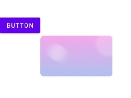

# 学习Behavior，先从它的使用开始入手

学习`Behavior`，先从用法开始。因为用法是最简单易学的，因为它的复杂逻辑都会被隐藏在内部，暴露给外部使用的都是很简单易理解的方法，因此，学习需要从用法开始，再深入到源码理解思路。

## Behavior是什么

首先，`Behavior`是`CoordinatorLayout`的一个子类，而`CoordinatorLayout`呢，从名字看，它是一个协调布局，换句话说就是一个控制者、主持人、幕后黑手。

它的功能就是操控它的子`View`，让他们进行互动。其中互动包括依赖关系（某个view依赖另一个view而进行交互），测量布局（控制子view的测量过程和布局过程），touch事件（自由指定某个view拦截事件），嵌套滑动（多个布局共同滑动）等。

但是这么多功能都写在`CoordinatorLayout`中显然是不可能的，因为这样会让它非常臃肿，并且不够自由，只能使用它定义好的一些交互行为。因此，将这些功能从`CoordinatorLayout`中抽取出来，单独行成一个模块，在这个模块中定义标准，可由开发者自定义根据标准自定义各种交互，然后由`CoordinatorLayout`去加载来操作。

所以`Behavior`是什么这个问题就知道了，它是`CoordinatorLayout`抽取出来的这个模块，更贴切的说应该是一个插件标准。

## Behavior能做什么

`Behavior`能做的事，就是前面提到的`CoordinatorLayout`的功能。当然在此之前，先看看如何使用`Behavior`。

### 使用Behavior

要想使用`Behavior`，首先要构造一个`Behavior`，然后设置给对应的`View`。那么，该如何构造`Behavior`呢？

```java
public Behavior() {}
public Behavior(Context context, AttributeSet attrs) {}
```

`Behavior`有两个构造方法，一个是空参数的构造方法，一个是双参数的构造方法。对于熟悉自定义`View`的我们而言，双参数的构造方法一看就是对应从`xml`中实例化出来的。

事实确实如此，空参数的构造方法一般都是手动去创建实例然后设置，双参数的一般都是直接在`xml`中设置。注意一点，**一个子`View`只能设置一个`Behavior`**。

- 1，`xml`中设置

  直接在`xml`中通过`app:layout_behavior="xxx"`给某个子view设置`Behavior`，其中`xxx`表示的是`Behavior`的类名。可以是缩略的如`.MyBehavior`，也可以是完整的如`com.xx.test.MyBehavior`。**建议使用完整包名**，毕竟当在`xml`中重定义`package`的时候，会导致出错。

- 2，直接创建实例设置

  手动创建的`Behavior`需要先拿到`child`的`params`，然后调用`setBehavior`进行设置。也就是`CoordinateLayout.LayoutParams#setBehavior`

- 3，通过注解进行设置

  使用注解方式也能设置`Behavior`，但是这样的话需要自定义`View`，然后在`View`的类名上添加注解`@DefaultBehavior(MyBehavior.class)`进行绑定。这种方式需要自定义`view`，几乎不使用。

一般而言，第一种方式是使用最多的，因为使用起来简直不要太简单。并且，第一种方式会走`Behavior`的双参数构造方法，我们甚至可以自定义属性设置在`xml`中然后交给`Behavior`去读取。如下：

- 1，在`attrs.xml`中定义属性和名称，和自定义`view`的做法一致

```xml
<resources>
    <declare-styleable name="MovableButton_Behavior">
        <attr name="sex" format="string" />
    </declare-styleable>
</resources>
```

- 2，在`xml`中设置这个属性

```xml
<androidx.coordinatorlayout.widget.CoordinatorLayout xmlns:android="http://schemas.android.com/apk/res/android"
    xmlns:app="http://schemas.android.com/apk/res-auto"
    android:layout_width="match_parent"
    android:layout_height="match_parent"
    tools:context=".MainActivity">

    <ImageView
        android:id="@+id/image"
        android:layout_width="wrap_content"
        android:layout_height="wrap_content"
        app:layout_behavior=".behavior.AttrBehavior"
        app:sex="aaaa" />

</androidx.coordinatorlayout.widget.CoordinatorLayout>
```

- 3，在`Behavior`中读取属性

```kotlin
class AttrBehavior(
    context: Context,
    attributeSet: AttributeSet
) : CoordinatorLayout.Behavior<View>(context, attributeSet) {

    init {
        context.obtainStyledAttributes(attributeSet, R.styleable.MovableButton_Behavior).use {
            val sex = it.getString(R.styleable.MovableButton_Behavior_sex)
            println("xml中设置的app:sex属性值为：$sex")
        }
    }

}
```

和自定义`View`时的自定义属性是一模一样的，非常简单。这里注意一点，就是`Behavior`的泛型参数，这个泛型代表的是`Behavior`可以设置在哪些控件上。如上例设置的是`View`，表示所有的`view`都能设置这个`Behavior`。若是设置为`ImageView`，则只有`ImageView`及其子类才能使用这个`Behavior`。


### Behavior能力之测量和布局

一个`View`的显示，通常经历三个步骤，测量、布局、绘制。而`Behavior`也能实现前两个步骤，这是因为`CoordinatorLayout`将对子`View`的测量和布局的过程放在了`Behavior`中。若是选择自定义测量布局，则`CoordinatorLayout`就不会再去测量布局了。

那么连测量和布局都抽取出去的`CoordinatorLayout`还剩下什么呢？

> CoordinatorLayout is a super-powered FrameLayout

这是`CoordinatorLayout`注释的第一句话，也就是说，他没有任何特殊的地方，就是一个普普通通（超级强大）的`FrameLayout`而已。普通的地方表现在它本身不具备其他布局能力，就只会像`FrameLayout`那样一层一层的往上堆。但是呢，它具备了`FrameLayout`不具备的拓展能力，即通过`Behavior`给自己拓展各种各样的能力，包括但不仅限于对子`view`的布局和测量。

#### 对应的方法

测量和布局对应的方法名称和`View`的方法非常类似，直接在`Behavior`中重写这两个方法实现自定义测量和布局，然后返回`true`即可。注意，**必须返回true**，否则当前自定义不会生效。

```java
boolean onMeasureChild(
	@NonNull CoordinatorLayout parent, 
	@NonNull V child,
    int parentWidthMeasureSpec,
    int widthUsed,
    int parentHeightMeasureSpec, 
    int heightUsed
)
    
boolean onLayoutChild(
	@NonNull CoordinatorLayout parent, 
	@NonNull V child,
    int layoutDirection
)
```

相对而言，自定义测量`onMeasureChild`用的较少，因为默认情况下父布局会像`FrameLayout`那样去测量子`View`，这种测量方式基本上已经够用了，而`onLayoutChild`用的会多一些。

#### 小例子

这里举个例子，说明一下`onLayoutChild`怎么使用：

```kotlin
class LayoutBehavior(
    context: Context,
    attr: AttributeSet
) : CoordinatorLayout.Behavior<View>(context, attr) {

    override fun onLayoutChild(
        parent: CoordinatorLayout,
        child: View,
        layoutDirection: Int
    ): Boolean {
        // 去查找是否有Button
        var target: Button? = null
        for (i in 0 until parent.childCount) {
            if (parent.getChildAt(i) is Button) {
                target = parent.getChildAt(i) as Button
                break
            }
        }
        target ?: return false
        // 将child放置在Button的右下方
        child.layout(
            target.right,
            target.bottom,
            target.right + child.measuredWidth,
            target.bottom + child.measuredHeight
        )
        return true
    }

}
```

然后在xml中，使用这个Behavior即可：

```xml
<androidx.coordinatorlayout.widget.CoordinatorLayout xmlns:android="http://schemas.android.com/apk/res/android"
    xmlns:app="http://schemas.android.com/apk/res-auto"
    xmlns:tools="http://schemas.android.com/tools"
    android:layout_width="match_parent"
    android:layout_height="match_parent"
    tools:context=".view.LayoutActivity">

    <Button
        android:layout_width="wrap_content"
        android:layout_height="wrap_content"
        android:layout_gravity="center_vertical"
        android:text="Button"
        tools:ignore="HardcodedText" />

    <ImageView
        android:layout_width="wrap_content"
        android:layout_height="wrap_content"
        android:src="@mipmap/bg"
        app:layout_behavior=".behavior.LayoutBehavior" />

</androidx.coordinatorlayout.widget.CoordinatorLayout>
```

然后运行即可看到`ImageView`被放置在了`Button`的右下角。



### Behavior能力之依赖关系

`Behavior`可以实现两个子`View`之间的依赖的关系，一个`View`依赖于另一个`View`，那么当被依赖的`View`发生位置尺寸的变化或者被移除时，另一个`View`也会触发相应的操作。

#### 对应的方法

```java
public boolean layoutDependsOn(
	@NonNull CoordinatorLayout parent, 
	@NonNull V child,
    @NonNull View dependency
)
```

首先，在`Behavior`中通过`layoutDependsOn`方法来确定依赖关系。这个方法有三个参数，第一个参数是父布局`parent`；第二个参数是设置了`Behavior`的那个`View`，被称为`child`；第三个参数就是依赖的`View`。我们需要做的就是在这个方法中去判断`child`与这个`view`是否需要存在依赖关系，若是存在依赖的话，则返回`true`，否则返回`false`。`Behavior`会遍历除了`child`外的其他`view`，然后将其带入这个方法去判断是否是依赖的对象。

例如`parent`有三个子`View`，其中有一个`View`设置了`Behavior`，那么`layoutDependsOn`方法会被调用两次，其中`parent`和`child`参数不变，每次变的是`dependency`参数。因此，依赖关系是一对多的。

> 注意，在Behavior中，都是用parent代表父布局，child代表设置了Behavior的子View

```java
public boolean onDependentViewChanged(
	@NonNull CoordinatorLayout parent, 
	@NonNull V child,
   	@NonNull View dependency
)
```

`onDependentViewChanged`则是依赖发生时调用的方法了，可以在这个方法中去声明`child`对依赖的响应行为。同样的，若是在这个方法中修改了`child`的尺寸或者位置，则需要返回`true`。

```java
public void onDependentViewRemoved(
	@NonNull CoordinatorLayout parent, 
	@NonNull V child,
    @NonNull View dependency
)
```

`onDependentViewRemoved`方法是发生在被依赖的`View`从父布局中移除的时候，也就是`child`失去了一个依赖的时候调用。

#### 小例子

下面写一个小例子用于表现这种依赖关系，在`CoordinatorLayout`中定义两个`View`，其中一个`View`依赖于另一个`View`，并一直处于依赖的`View`的下方。

首先定义一个可移动的按钮`MovableButton`，因为依赖事件发生的前提是被依赖的`View`位置或者尺寸发生变化，因此这里需要有一个可以移动位置的`View`。下面定义一个`MovableButton`，并没有什么实质内容。

```kotlin
// 一个简单view，可以跟随手指而动
class MovableButton @JvmOverloads constructor(
    context: Context,
    attributeSet: AttributeSet? = null
) : AppCompatButton(context, attributeSet) {

    private var mInitX = 0F
    private var mInitY = 0F
    private var mEventX = 0F
    private var mEventY = 0F

    override fun onTouchEvent(event: MotionEvent?): Boolean {
        when (event?.actionMasked) {
            MotionEvent.ACTION_DOWN -> {
                mInitX = x
                mInitY = y
                mEventX = event.rawX
                mEventY = event.rawY
            }
            MotionEvent.ACTION_MOVE -> {
                x = mInitX + event.rawX - mEventX
                y = mInitY + event.rawY - mEventY
            }
        }
        return super.onTouchEvent(event)
    }

}
```

然后开始写`Behavior`，在`Behavior`中确定依赖关系并且定义相应的操作。

```kotlin
class BelowBehavior(
    context: Context,
    attributeSet: AttributeSet
) : CoordinatorLayout.Behavior<View>(context, attributeSet) {

    override fun layoutDependsOn(
        parent: CoordinatorLayout,
        child: View,
        dependency: View
    ): Boolean {
    	// 设置只有MovableButton才能作为被依赖View
        return dependency is MovableButton
    }

    override fun onDependentViewChanged(
        parent: CoordinatorLayout,
        child: View,
        dependency: View
    ): Boolean {
    	// 让child一直处在被依赖的View下面
        child.y = dependency.height + dependency.translationY
        return true
    }
    
     override fun onDependentViewRemoved(
        parent: CoordinatorLayout, child: View,
        dependency: View
    ) {
        // 当被依赖的view被移除的时候，将child的位置重置在界面顶部
        child.y = 0F
    }

}
```

注意一点的是，在`layoutDependsOn`中确定依赖的条件是很简单的，只要`View`是`MovableButton`即可。实际中的条件应该更复杂一些的，因为简单的条件很容易形成多个依赖的`View`。

然后是在`xml`中使用`Behavior`，注意这里都是在`xml`中使用`Behavior`，因为比较简单：

```xml
<?xml version="1.0" encoding="utf-8"?>
<androidx.coordinatorlayout.widget.CoordinatorLayout xmlns:android="http://schemas.android.com/apk/res/android"
    xmlns:app="http://schemas.android.com/apk/res-auto"
    xmlns:tools="http://schemas.android.com/tools"
    android:id="@+id/parent"
    android:layout_width="match_parent"
    android:layout_height="match_parent"
    tools:context=".MainActivity">

    <com.study.androidbehavior.widget.MovableButton
        android:id="@+id/movable_button"
        android:layout_width="wrap_content"
        android:layout_height="wrap_content" />

    <ImageView
        android:id="@+id/image"
        android:layout_width="wrap_content"
        android:layout_height="wrap_content"
        android:src="@mipmap/bg"
        app:layout_behavior=".behavior.BelowBehavior" />
    
    <Button
        android:id="@+id/button_remove"
        android:layout_width="wrap_content"
        android:layout_height="wrap_content"
        android:layout_gravity="end"
        android:text="移除按钮" />

</androidx.coordinatorlayout.widget.CoordinatorLayout>
```

在xml中定义了三个`View`，`MovableButton`是被当做被依赖`View`的，可以随手指而动。`ImageView`是设置`Behavior`的子`View`，一直跟在`MovableButton`的下面。`Button`点击一下就会将`MovableButton`从父布局中移除，用于触发依赖消失的事件。

最后是在`activity`中随便写写点击事件了：

```kotlin
class BelowActivity : AppCompatActivity() {
    private lateinit var mParent: CoordinatorLayout
    private lateinit var mButtonMovable: MovableButton
    private lateinit var mButtonRemove: Button

    override fun onCreate(savedInstanceState: Bundle?) {
        super.onCreate(savedInstanceState)
        setContentView(R.layout.activity_below)

        mParent = findViewById(R.id.parent)
        mButtonMovable = findViewById(R.id.movable_button)
        mButtonRemove = findViewById(R.id.button_remove)
        mButtonRemove.setOnClickListener {
            mParent.removeView(mButtonMovable)
        }
    }
}
```

最后是效果图如下：


### Behavior能力之touch事件

在`View`的事件分发中，事件都是先分发给最里层的子`View`的，当子`View`决定不处理`touch`事件的时候，外层的父布局才会得到处理事件的机会。但这也不是一定的，因为父布局中有一个方法可以用来拦截事件，这样事件就会直接交给父布局进行处理，而不会传递给子`View`了。

`CoordinatorLayout`作为一个父布局(`ViewGroup`)一定也是有这个拦截的功能的，但是同样的，它本身也没去实现拦截的机制，而是将这个功能抽取到`Behavior`中，由`Behavior`去决定`CoordinatorLayout`是否拦截此次的事件。当决定拦截了事件后，同样的`CoordinatorLayout`也不去处理这些事件，而是将这些事件传递给决定拦截事件的这些`Behavior`中，由`Behavior`去处理。

#### 对应的方法

```java
public boolean onInterceptTouchEvent(
	@NonNull CoordinatorLayout parent, 
	@NonNull V child,
    @NonNull MotionEvent ev
)

public boolean onTouchEvent(
	@NonNull CoordinatorLayout parent, 
	@NonNull V child,
    @NonNull MotionEvent ev
)
```

和`ViewGroup`一样的方法，通过`onInterceptTouchEvent`进行拦截，然后在`onTouchEvent`中去处理。注意的是`Behavior`中的所有能力都是从`CoordinatorLayout`中拓展出来的，也就是`CoordinatorLayout`将本该它自己做的工作转移到了`Behavior`中。因此，事件的分发过程是先到了`CoordinatorLayout`中，再对子`View`按照`topMost`的顺序进行分发的。`topMost`顺序就是从上到下，对应的子`View`是从后到前，也就是最后一个子`View`是最上层的。

#### 小例子

因为直接处理事件太麻烦了，所以这里没有小例子。


### Behavior能力之嵌套滑动

当两个可同向滑动的`View`嵌套在一起时，如`ScrollView`有一个子`View`是`RecyclerView`，那么当滚动的时候是先滚动`ScrollView`还是先滚动`RecyclerView`呢？假如是滚动`RecyclerView`，那么当`RecyclerView`快滚动到底部的时候，这时候来一个比较长的滚动，当`RecyclerView`滚动到底部后，剩下的滚动就是没有反应，并不会变成`ScrollView`接着滚动。这是由`View`的事件分发机制造成的，`View`事件分发中，当某个`View`处理事件的时候，这次的事件流就会全部交个它而不会给别的`View`。

而嵌套滑动就是用来处理这种冲突的，尤其是它实现了将一个事件流交给多个`View`去处理这种功能，从而可以让滑动更加流畅更加符合我们的期望。它使用两套接口来实现这种功能，分别是`NestedScrollingChild3`和`NestedScrollingParent3`，对应着子`View`和父`View`，当然也可以同时实现这两个接口，这样就可以为所欲为了。

虽然`CoordinatorLayout`也实现了`NestedScrollingParent3`接口，但是它并不是像传统的那种嵌套滑动一样来处理滑动事件，而是将滑动事件代理给了`Behavior`，也就是在嵌套滑动中，是`Behavior`来作为`parent`处理滑动事件的。也就是说，`CoordinatorLayout`中的嵌套滑动并不需要嵌套，同时，由于在嵌套滑动中作为`parent`的是`Behavior`，所以实际上想要作为`parent`的子`View`只需要设置`Behavior`即可，而不用去实现`NestedScrollingChild3`接口。

总之，`CoordinatorLayout`使用嵌套滑动逻辑实现了一套不是嵌套滑动的嵌套滑动。

> 注意，嵌套滑动必须由`NestedScrollingChild3`发起，`RecyclerView`就实现了这个方法

#### 对应的方法

```java
public boolean onStartNestedScroll(
    @NonNull CoordinatorLayout coordinatorLayout,
    @NonNull V child, 
    @NonNull View directTargetChild, 
    @NonNull View target,
    @ScrollAxis int axes, 
    @NestedScrollType int type
)
```

这是嵌套滑动开始的方法，当发生嵌套滑动的时候，会先调用这个方法，判断`Behavior`是否需要参与此次的滑动，返回`true`表示参与这次滑动，才会有后续的方法调用，否则后续的事件都不会再回调到这个`Behavior`中。

其中前两个参数不用说了，第三个参数`directTargetChild`是发生滑动的`View`在`CoordinatorLayout`中的直接子布局，而`target`表示的是发生滑动的那个`View`。当`target`直接出现在`CoordinatorLayout`中的时候，这时候的`directTargetChild`和`target`是同一个对象。如下布局中，`directTargetChild`就是`FrameLayout`，而`target`是`RecyclerView`。

```xml
<androidx.coordinatorlayout.widget.CoordinatorLayout...>

    <FrameLayout...>
        
        <androidx.recyclerview.widget.RecyclerView... />
        
    </FrameLayout>

    ...

</androidx.coordinatorlayout.widget.CoordinatorLayout>
```

最后两个参数是一个是滚动的方向，一个是滚动的类型。`axes`表示滑动的方向，有垂直和横向两种类型，取值为`ViewCompat#SCROLL_AXIS_HORIZONTAL`和`ViewCompat#SCROLL_AXIS_VERTICAL`。而`type`表示滑动的类型，取值为`ViewCompat#TYPE_TOUCH`和`ViewCompat#TYPE_NON_TOUCH`。

当`Behavior`想要参与此次的嵌套滑动的时候，需要返回`true`。

```java
public void onNestedScrollAccepted(
	@NonNull CoordinatorLayout coordinatorLayout,
    @NonNull V child, 
    @NonNull View directTargetChild, 
    @NonNull View target,
    @ScrollAxis int axes, 
    @NestedScrollType int type
)
```

`onNestedScrollAccepted`的参数和`onStartNestedScroll`是一样的，这个方法是当`onStartNestedScroll`返回`true`的时候调用的，他与`onStartNestedScroll`是绑定在一起的，每次`onStartNestedScroll`返回`true`都会调用一次这个方法。可以在该方法中去处理嵌套滑动的前置准备，如初始化状态等。

```java
public void onNestedPreScroll(
	@NonNull CoordinatorLayout coordinatorLayout,
    @NonNull V child, 
    @NonNull View target, 
    int dx, 
    int dy, 
    @NonNull int[] consumed,
    @NestedScrollType int type
)

public void onNestedScroll(
	@NonNull CoordinatorLayout coordinatorLayout, 
	@NonNull V child,
    @NonNull View target, 
    int dxConsumed, 
    int dyConsumed, 
    int dxUnconsumed,
    int dyUnconsumed, 
    @NestedScrollType int type, 
    @NonNull int[] consumed
)
```

上面两个方法才是真正滑动的时候回调的方法。在发生嵌套滑动并且`Behavior`接受了这次滑动后，会先调用`onNestedPreScroll`方法。注意这个方法是发生在`Behavior`中的，也就是说，当有滑动事件的时候，是优先传递给`Behavior`去处理的。其中参数`dx`和`dy`表示的是滑动的距离，而数组`consumed`的长度为2，表示的是`Behavior`消耗的滑动距离。`consumed[0]`为对`dx`的消耗，`consumed[1]`为对`dy`的消耗，当`Behavior`消耗滑动后，需要手动的将消耗的多少填充到数组中。

当`Behavior`处理完后，剩余的事件会传递给`target`去处理，当然这时候的处理跟我们无关了，是由`target`本身的逻辑去处理了。而当`target`滚动结束后，剩下的事件又会传递到`parent`中进而传递给`Behavior`的`onNestedScroll`方法。该方法的中间四个参数没什么可说的，从名字就可以看出是`dx`和`dy`的已消耗的和未消耗的值。`consumed`数组也是一样的，存放消耗的事件。注意的是，此时`consumed`数据可能是已经有值的，因此我们消耗后，需要进行叠加而不是赋值。例如消耗`deltaY`，则应该`consumed[1] += deltaY`。

```java
public boolean onNestedPreFling(
	@NonNull CoordinatorLayout coordinatorLayout,
    @NonNull V child, 
    @NonNull View target, 
    float velocityX, 
    float velocityY
)

public boolean onNestedFling(
	@NonNull CoordinatorLayout coordinatorLayout,
    @NonNull V child, 
    @NonNull View target, 
    float velocityX, 
    float velocityY,
    boolean consumed
)
```

当子`View`发生惯性滑动也就是`flin`的时候，同样是先传递给`Behavior`。也就是`onNestedPreFling`方法，`Behavior`需要在这个方法中去判断是否需要消耗这次的惯性滑动，若是需要的话则返回`true`。然后就是再交还给子`View`去进行判断是否需要显示`overScroll`，然后再通过`onNestedFling`传递回`Behavior`中。其中参数`consumed`表示嵌套子`View`(发起滚动的子`View`)是否消耗此次惯性滑动，若是`Behavior`需要消耗此次滚动，则需要返回`true`。

```java
 public void onStopNestedScroll(
 	@NonNull CoordinatorLayout coordinatorLayout,
    @NonNull V child, 
    @NonNull View target, 
    @NestedScrollType int type
)
```

在滚动结束后，会调用`onStopNestedScroll`方法，可以在这个方法中去做一些收尾工作。所以嵌套滑动一共涉及到七个方法，滑动刚开始的两个方法，滑动过程中的两个方法，惯性滑动的两个方法，以及收尾的一个方法。并且，滑动事件的顺序都是`子View->Behavior->子View->Behavior`。因此滑动过程和惯性滑动过程都是两个方法，一个是第一次开始处理，一个是子`View`处理后剩下的再去处理。

#### 小例子

[使用Behavior实现一个跟随滚动的嵌套滑动效果](./Behavior小例子.md)

## 总结

首先，`Behavior`是一个插件，它是`CoordinatorLayout`抽取出来的一个标准。`CoordinatorLayout`将本身的各种能力抽取到了`Behavior`中，在需要的时候去加载它从而实现某些交互。

其次，`Behavior`一共有四种能力：**测量布局，依赖，touch，嵌套滑动**。其中依赖和嵌套滑动用的是最多的，然后是布局和测量，最后才是touch。

当学会了`Behavior`的各个方法的使用后，就可以设计出各种花里胡哨的操作了。


