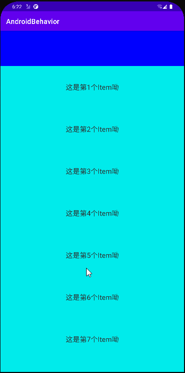
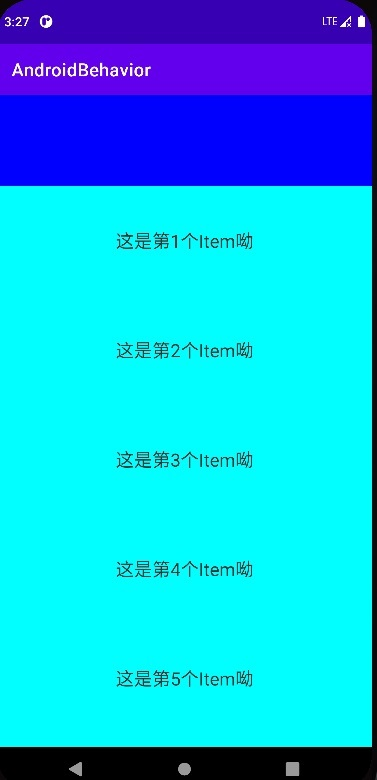
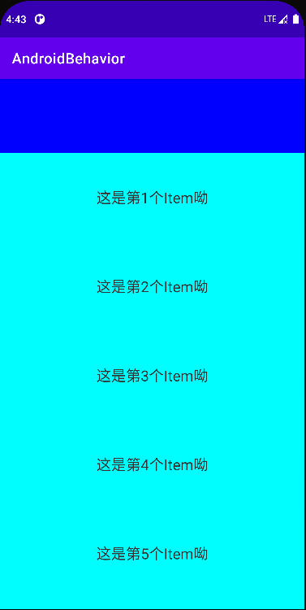
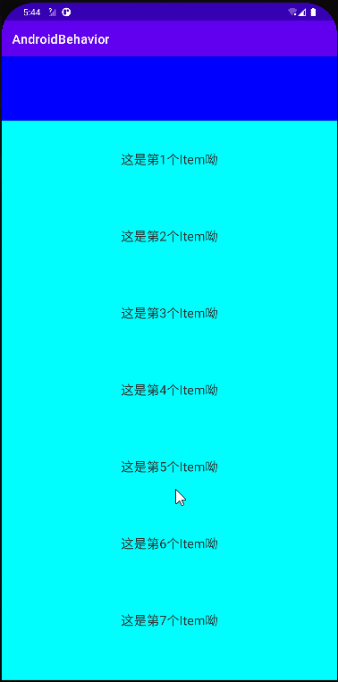
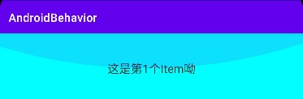

# 使用Behavior实现一种跟随滚动的嵌套滑动效果

本文是对文章中[方法介绍+小例子，我学会了Behavior](../how-to-learn-behavior)的拓展，将使用`Behavior`的多种能力，依赖布局嵌套滑动等，实现一种常用的嵌套机制。目标效果如下：



## 布局设置

首先，设置`xml`布局，界面只有两个元素，`TextView`和`RecyclerView`。其中`TextView`比较简单，只是设置了背景，其他的都没有设置。而`RecyclerView`也比较简单，就是一个普通的列表，具体的`Adapter`也不再赘述了。

```xml
<?xml version="1.0" encoding="utf-8"?>
<androidx.coordinatorlayout.widget.CoordinatorLayout
    xmlns:android="http://schemas.android.com/apk/res/android"
    xmlns:app="http://schemas.android.com/apk/res-auto"
    xmlns:tools="http://schemas.android.com/tools"
    android:layout_width="match_parent"
    android:layout_height="match_parent"
    tools:context=".view.TouchActivity">

    <TextView
        android:layout_width="match_parent"
        android:layout_height="100dp"
        android:background="#0000FF" />

    <androidx.recyclerview.widget.RecyclerView
        android:id="@+id/recycler"
        android:layout_width="match_parent"
        android:layout_height="match_parent"
        android:background="#00FFFF"
        app:layoutManager="androidx.recyclerview.widget.LinearLayoutManager"
        tools:itemCount="10"
        tools:listitem="@layout/item_recycler" />

</androidx.coordinatorlayout.widget.CoordinatorLayout>
```

若是直接运行的话，会看不到`TextView`。因为`CoordinatorLayout`在不设置`Behavior`的情况下，相当于是一个`FrameLayout`，因此`TextView`会被`RecyclerView`覆盖在下方而导致什么都看不到。

## Behavior

为了避免覆盖的情况，下面将定义多个`Behavior`，从而逐步实现目标效果。

### ToBottomBehavior 为TextView留出位置

首先`CoordinatorLayout`默认是把子`View`都堆在左上角的，因此想要`TextView`显示出来，需要将`RecyclerView`向下移动，移动的距离为`TextView`的高度。因此，需要重写`Behavior`的`onLayoutChild`方法，然后重新进行`layout`。

```kotlin
class ToBottomBehavior(
    context: Context,
    attr: AttributeSet? = null
    // 由于只给RecyclerView使用，所以这里泛型直接使用RecyclerView
) : CoordinatorLayout.Behavior<RecyclerView>(context, attr) {

    override fun onLayoutChild(
        parent: CoordinatorLayout,
        child: RecyclerView,
        layoutDirection: Int
    ): Boolean {
        // 低于两个子View的时候不去布局了
        if (parent.childCount < 2) {
            return false
        }
        val firstView = parent.getChildAt(0)
        // measure的时候height是match_parent的高度，
        // 而实际布局后，高度变成了match_parent减去firstView的高度
        child.layout(0, firstView.measuredHeight, child.measuredWidth, child.measuredHeight)
        return true
    }

}
```

然后将这个`Behavior`设置给`RecyclerView`即可：

```xml
<androidx.coordinatorlayout.widget.CoordinatorLayout...>
    
    <TextView .../>
    
    <androidx.recyclerview.widget.RecyclerView ... 
      	app:layout_behavior=".behavior.ToBottomBehavior"/>

</androidx.coordinatorlayout.widget.CoordinatorLayout>
```

此时运行后就会显示出`TextView`了：




### TouchBehavior 开启嵌套滑动

经过前面的设置，已经实现了上面是`TextView`下面是`RecyclerView`的布局了。后面该做的事就是在滚动的时候，让`TextView`先向上滚出屏幕：然后再继续`RecyclerView`的滚动。

本次所做的任务是由`RecyclerView`的滚动驱动`TextView`向上滚动，很明显就是嵌套滑动了。首先将滑动分配给`TextView`，当`TextView`滚出屏幕后不再消耗滚动事件，然后再还给`RecyclerView`去滚动。

```kotlin
class TouchBehavior(
    context: Context,
    attr: AttributeSet? = null
) : CoordinatorLayout.Behavior<View>(context, attr) {

    override fun onStartNestedScroll(
        coordinatorLayout: CoordinatorLayout,
        child: View,
        directTargetChild: View,
        target: View,
        axes: Int,
        type: Int
    ): Boolean {
        // 只拦截纵向的滚动
        return axes == ViewCompat.SCROLL_AXIS_VERTICAL
    }

    override fun onNestedPreScroll(
        coordinatorLayout: CoordinatorLayout,
        child: View,
        target: View,
        dx: Int,
        dy: Int,
        consumed: IntArray,
        type: Int
    ) {
        // 注意，手指向上滑动的时候，dy大于0。向下的时候dy小于0。
        val translationY = child.translationY
        if (-translationY >= child.measuredHeight || dy < 0) {
            // child已经滚动到屏幕外了，或者向下滚动，就不去消耗滚动了
            return
        }
        // 还差desireHeight距离将会移出屏幕外
        val desireHeight = translationY + child.measuredHeight
        if (dy <= desireHeight) {
            // 将dy全部消耗掉
            child.translationY = translationY - dy
            consumed[1] = dy
        } else {
            // 消耗一部分的的dy
            child.translationY = translationY - desireHeight
            consumed[1] = desireHeight.toInt()
        }
    }

}
```

注意这里省略了一个`onNestedScrollAccepted`方法，因为我们这个比较简单，不需要什么初始化前置操作。然后设置给`TextView`，因为嵌套滑动的触发者是`RecyclerView`，作用者(parent)是`TextView`。所以需要将这个`Behavior`设置给`TextView`。

```xml
<androidx.coordinatorlayout.widget.CoordinatorLayout ...>

    <TextView ...
        app:layout_behavior=".behavior.TouchBehavior"/>
    
    <RecyclerView .../>
    
</androidx.coordinatorlayout.widget.CoordinatorLayout>
```




从上图可以看到的是，嵌套滑动已初具模型。先是滚动`TextView`，然后接着滚动`RecyclerView`。但是还是有一点问题，就是在滚动的时候`TextView`和`RecyclerView`分离了，中间留有一大片的空白。因此，还需要继续优化，在`TextView`滚动的时候将`RecyclerView也`向上滚动。

这种情况应该是属于`Behavior`的依赖功能，也就是`RecyclerView`依赖于`TextView`，并一直处于`TextView`的下方。因此，这个操作应该放在`RecyclerView`的`Behavior`之中。

```kotlin
class ToBottomBehavior(..){
	...

    override fun layoutDependsOn(
        parent: CoordinatorLayout,
        child: RecyclerView,
        dependency: View
    ): Boolean {
        return dependency === parent.getChildAt(0)
    }

    override fun onDependentViewChanged(
        parent: CoordinatorLayout,
        child: RecyclerView,
        dependency: View
    ): Boolean {
        child.translationY = dependency.translationY
        return true
    }

}
```

在`ToBottomBehavior`中重写了`layoutDependsOn`方法，并且只依赖于第一个子`View`。然后在`onDependentViewChanged`方法中通过`tranlationY`来移动child的位置。虽然这样写也是可以的，但是会有一个问题，就是当`RecyclerView`向上移动的时候，底部会留出一片空白。

这是因为在重写自定义布局的时候，给`RecyclerView`设置`layout`的时候，让它的高度变成了`match_parent`减去`TextView`的高度了。因此当它向上移动的时候，会因为高度不够而导致底部有留白。所以，`onDependentViewChanged`方法并不能只是改变位置，同样的还需要改变高度，因此这里直接重新`layout`了。

```kotlin
class ToBottomBehavior(...) {

    ...

    override fun onDependentViewChanged(
        parent: CoordinatorLayout,
        child: RecyclerView,
        dependency: View
    ): Boolean {
//        child.translationY = dependency.translationY
        child.layout(
            0,
            (dependency.bottom + dependency.translationY).toInt(),
            child.measuredWidth,
            child.measuredHeight
        )
        return true
    }

}
```

这样的话，在`TextView`位置变化的时候，会重新对`RecyclerView`进行布局，因此高度也会有所变化，从而使其可以一直填充父布局而不会底部留白，效果如下。



此时大体上已经满足我们的要求了，而且滑动是连续的，在`TextView`滚动到屏幕外后，会紧接着进行`RecyclerView`的滚动，而不会发生停顿。但是上面其实还是有一个问题的，当`RecyclerView`滚动到顶部/底部的时候，应该会显示一个`OverScroll`的效果(一个蓝色的弧线)，但是这里并没有显示。




这是因为，在嵌套滑动的事件中，滑动事件是从`child->parent->child->parent`的。而`Behavior`就是担任parent角色的。一开始发生了滚动事件，从child中传递到parent中，然后我们在parent中处理`TextView`的向上移动这个动作，然后处理完后事件又传递给child进行滚动，当child滚动到底部后不能再滚动了，这时候事件又传递给了parent。但是，我们并没有处理这次的事件(`onNestedScroll`)，因为会采用默认的实现，如下：

```java
public void onNestedScroll(
    @NonNull CoordinatorLayout coordinatorLayout, 
    @NonNull V child,
    @NonNull View target, 
    int dxConsumed, 
    int dyConsumed, 
    int dxUnconsumed,
    int dyUnconsumed, 
    @NestedScrollType int type, 
    @NonNull int[] consumed
) {
    consumed[0] += dxUnconsumed;
    consumed[1] += dyUnconsumed;
    onNestedScroll(coordinatorLayout, child, target, dxConsumed, 
        dyConsumed, dxUnconsumed, dyUnconsumed, type);
}
```

而在默认的实现中，直接将所有的事件给消耗了，在child不能消耗滚动事件后(滚动到底部)，剩下的事件都被parent消耗了。这对于child而言，就是child滚动到底部后就停止了事件流，因此child才不会出现`OverScroll`效果的。所以，我们还应该重写`onNestedScroll`并给他一个空实现即可出现`OverScroll`效果了。

另外，顶部的`TextView`滚动出去之后就一直不见了。我们现在还想在`RecyclerView`滚动到顶部后，再继续滚动的时候把`TextView`再滚出来。这时候就是应该在`onNestedScroll`中操作了。

```kotlin
class TouchBehavior(...) {

    ...

    override fun onNestedScroll(
        coordinatorLayout: CoordinatorLayout,
        child: View,
        target: View,
        dxConsumed: Int,
        dyConsumed: Int,
        dxUnconsumed: Int,
        dyUnconsumed: Int,
        type: Int,
        consumed: IntArray
    ) {
        val translationY = child.translationY
        if (translationY >= 0 || dyUnconsumed > 0) {
            // 手指向上滚动或者child已经滚出了屏幕，不去处理
            return
        }
        if (dyUnconsumed > translationY) {
            // 全部消耗
            consumed[1] += dyUnconsumed
            child.translationY = translationY - dyUnconsumed
        } else {
            // 消耗一部分
            consumed[1] += child.translationY.toInt()
            child.translationY = 0F
        }
    }

}
```

修改后的如下图所示：


完整代码在这里： [点击跳转github链接](https://github.com/pgaofeng/AndroidBehavior)


## 总结

完全的touch事件重写是很麻烦的，因此我们几乎不去重写这种事件，而是使用已经封装好的滑动事件。当然，嵌套滑动也是比较麻烦的，因为要实现一个嵌套滑动的parent或者child首先都需要自定义`View`，并且处理很麻烦的滑动关系，还需要处理子`View`的测量布局等。

而`CoordinatorLayout`本身就已经实现了这些我们不是很关注的东西，并且将嵌套滑动过程中parent的功能都提取到了`Behavior`中，因此，我们可以不需要自定义`View`，只需要给`View`设置一个`Behavior`，就能轻轻松松让它作为一个嵌套滑动的parent，即使它并没有实现`NestedScrollingParent3`接口。

嵌套滑动的顺序是：**child发起 -> parent先处理 -> child后处理 -> parent再处理 -> 还给child**

作为parent，我们需要处理两次滑动事件，一次是刚开始的预处理(`onNestedPreScroll`)，一次是child处理后又传递过来的(`onNestedScroll`)，我们要做的就是判断当前要做的操作在哪个阶段就行了。


