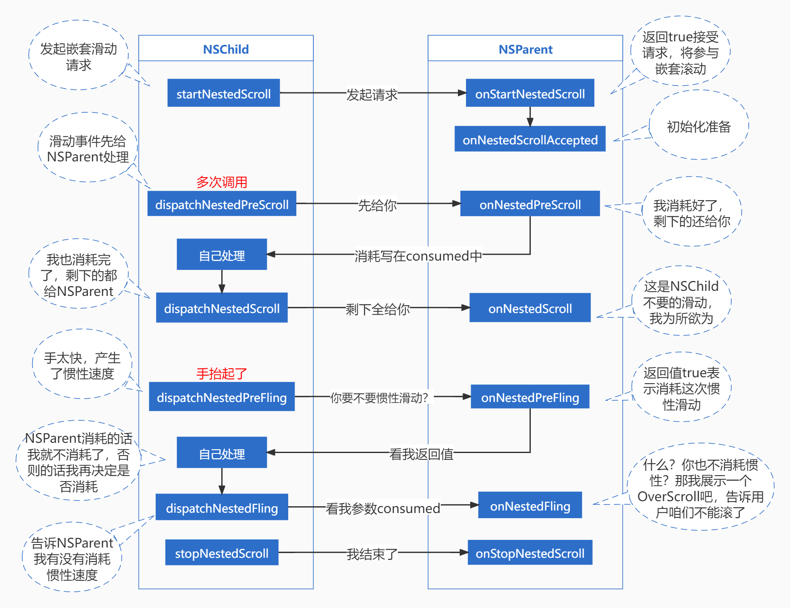
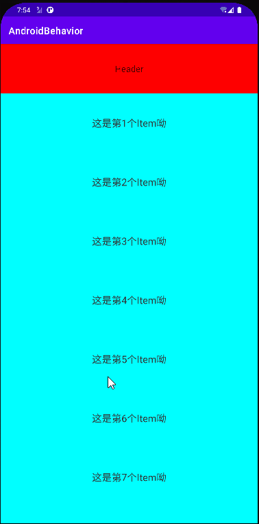

# 深入理解嵌套滑动---原理、设计思路


## 嵌套滑动会出现的问题

首先嵌套滑动，一定涉及的是滑动组件的嵌套。当发生嵌套的时候，再产生滑动事件就会发生滑动冲突。如同向的两个嵌套的View在发生滑动的时候，如何决定由哪个View进行滑动？

这个问题通常使用内部拦截和外部拦截两种方式去处理。但是，不管采用哪种方式，在滑动过程中，参与的对象都是单一的。也就是一个系列的滑动事件(`down->move->...->move->up/cancel`)，要么给外部的View去处理，要么给内部的View去处理，这是由传统的事件分发机制所决定的。

但这样会出现一种问题，即滑动会丢失连续性。我们更想要的效果是内部View滚动到底部后，继续滑动手指的时候外部View可以接着滚动，这种连续性是传统的事件分发无法做到的。

## 嵌套滑动接口的出现

>  后面称`NestedScrollingParent`为**NSParent**，`NestedScrollingChild`为**NSChild**。

为了解决嵌套滑动的连续性问题，`NSParent`和`NSChild`应运而生。看到这两个接口的名字就知道，`NSParent`是嵌套的父布局所应该实现的接口，而`NSChild`是嵌套的子布局应该实现的接口。通过这两个接口的方法，从而实现嵌套滑动的连续性。

### NSChild和NSParent相关的方法

在`NSChild`和`NSParent`接口中，定义着一系列的方法，看起来是很复杂很难理解。但若是将他们两个放在一起进行比较的话，就很容易理解了。


##### 一、开启嵌套滑动

```java
// NSChild
boolean startNestedScroll(@ScrollAxis int axes);


// NSParent
boolean onStartNestedScroll(
    @NonNull View child,  // NSChild在NSParent中的直接父布局
    @NonNull View target, // 直接滑动的NSChild
    @ScrollAxis int axes);

void onNestedScrollAccepted(
    @NonNull View child,
    @NonNull View target, 
    @ScrollAxis int axes);
```

滑动是由`NSChild`发起的，因此当发生滑动的时候，会先调用`NSChild#startNestedScroll`方法去开启嵌套滑动。同样的，在`NSParent`中也有一个对应的方法，就是`onStartNestedScroll`，当`NSChild`开启嵌套滑动的时候，`NSParent`可以在`onStartNestedScroll`中对本次滑动做出响应，即是否要参与此次的嵌套滑动。只有建立了嵌套滑动关系后（`onStartNestedScroll`返回true），`NSParent`才会收到后续的方法回调。

`onNestedScrollAccepted`与`onStartNestedScroll`是绑定的，每次`onStartNestedScroll`返回true的时候就会调用它，可以在这个方法中做一些嵌套滑动的前置准备如参数初始化等。

##### 二、开始嵌套滑动

###### 1. NSParent优先消耗滚动

```java
// NSChild
boolean dispatchNestedPreScroll(
    int dx, 
    int dy, 
    @Nullable int[] consumed,
    @Nullable int[] offsetInWindow
);


// NSParent
void onNestedPreScroll(
    @NonNull View target, 
    int dx, 
    int dy, 
    @NonNull int[] consumed
);
```

当开始滑动的时候，滑动事件会通过`NSChild#dispatchNestedPreScroll`去分发，将事件分发给`NSParent#onNestedPreScroll`先进行消耗。然后`NSParent`消耗之后，需要将消耗的距离放入数组`consumed`中。其中`consumed`数组长度为2，分别是`dx`的消耗和`dy`的消耗。

若是`NSParent`消耗了滑动事件(可以通过对`consumed`数组来进行判断`NSParent`是否消耗滑动)，`NSChild#dispatchNestedPreScroll`应该返回true，否则返回false。

###### 2. 再次给NSParent处理滑动

```java
// NSChild
boolean dispatchNestedScroll(
    int dxConsumed, 
    int dyConsumed,
    int dxUnconsumed, 
    int dyUnconsumed, 
    @Nullable int[] offsetInWindow
);

// NSParent
void onNestedScroll(
    @NonNull View target, 
    int dxConsumed, 
    int dyConsumed,
    int dxUnconsumed, 
    int dyUnconsumed
);
```

前面说了，当发生滚动的时候，会先将事件分发给`NSParent`去消耗，剩下的才轮到`NSChild`进行消耗（这里没有额外的方法，因为这整个过程应该发生在`onTouchEvent`中）。当`NSChild`消耗之后，剩余的事件还会再次分发给`NSParent`。通过方法`dispatchNestedScroll`分发已消耗的距离和未消耗的距离，进而调用到`NSParent`的`onNestedScroll`方法。

`dispatchNestedScroll`方法也有一个返回值，但是它返回的不是`NSParent`是否消耗了事件，而是表示这次的事件有没有分发给`NSParent`。


所以嵌套滑动的过程就是：**NSChild产生滑动 -> NSParent先消耗 -> NSChild再消耗 -> 剩下全给NSParent**

##### 三、开始惯性滑动

当手指快速滑动并抬起时，会产生惯性滑动，也就是`Fling`。惯性滑动和普通滑动有一点区别，就是惯性滑动实际上并不是真正的滑动，它是手指快速滑动并抬起后，产生的一个速度，然后通过`Scroller`将速度模拟成滑动。

###### 1. 先询问NSParent是否消耗惯性滑动

```java
// NSChild
boolean dispatchNestedPreFling(float velocityX, float velocityY);

// NSParent
boolean onNestedPreFling(@NonNull View target, float velocityX, float velocityY);
```
惯性滑动的分发和普通滑动有点区别，就是因为惯性滑动实际上只有一个速度，没有实际的滑动。因此，在进行惯性的分发时，只是分发了速度。

同样的，当发生惯性滑动的时候，也是先通过`dispatchNestedPreFling`去分发惯性滑动的速度。进而会调用到`NSParent`的`onNestedPreFling`方法，该方法是`NSParent`用来决定是否需要参与这次的惯性滑动的，若是参与，则返回true。

###### 2. 再告诉NSParent自己是否惯性滑动

```java
// NSChild
boolean dispatchNestedFling(float velocityX, float velocityY, boolean consumed);

// NSParent
boolean onNestedFling(
    @NonNull View target, 
    float velocityX, 
    float velocityY, 
    boolean consumed // NSChild是否消耗，true消耗
);
```

前面在发生惯性滑动的时候，已经先分发给了`NSParent`并询问它是否需要消耗惯性速度，然后才是`NSChild`决定自己是否需要消耗惯性滑动。最后，再通过`dispatchNestedFling`方法将自己是否要消耗速度的决定再次分发给`NSParent#onNestedFling`（通过`consumed`参数）。

为什么要多此一举呢，前面已经问过了`NSParent`是否需要消耗，为什么当`NSChild`决定后还需要再告诉`NSParent`自己的决定呢？这是考虑到，当`NSParent`不消耗惯性滑动，并且`NSChild`也不消耗惯性滑动的时候，`NSParent`可以显示`OverScroll`样式(一个蓝色的弧线)。

##### 三、结束嵌套滑动

```java
// NSChild
void stopNestedScroll();

// NSParent
void onStopNestedScroll(@NonNull View target);
```

当滑动结束后，需要调用这个方法去进行收尾工作。所以整个流程是这样的：



##### 四、其他方法

`NSChild`的其他方法

```java
// 设置嵌套滑动能力是否开启
void setNestedScrollingEnabled(boolean enabled);
// 当前是否支持嵌套滑动
boolean isNestedScrollingEnabled();
// 是否有嵌套的NSParent
boolean hasNestedScrollingParent();

```

`NSParent`的其他方法

```java
// 获取当前滚动的方向
int getNestedScrollAxes();
```

##### 小结

可以看到，将`NSChild`和`NSParent`对比着来看的话，各个方法还是很好理解的，因为基本上都是对应的。并且也看到了在嵌套滑动中，是分了两个部分的：一部分是普通滑动，一部分是惯性滑动。普通滑动是将其分别分给了`NSParent`和`NSChild`，但是惯性滑动因为只有一个速度，所以要么是`NSParent`处理要么是`NSChild`处理。

很明显，普通滑动是做到了连续性了，但是惯性滑动并没有做到连续性。因为发生惯性滑动时将速度只给了一个角色去处理，所以惯性滑动仍然是不连续的。

例如当`NSChild`消耗惯性滚动的时候，当它惯性滚动到底部的时候，我们想要的是外部的`NSParent`接着滚动，但按照现在的逻辑这是做不到的。所以当`NSChild`惯性滚动到底部后就会停下没有后续了。

#### NSChild2和NSParent2

因为速度是唯一的，不可能将速度拆分开来给再去分发，所以惯性滑动的行为只能由一个角色去处理。既然惯性滑动不能拆分，那就换个思路：由`NSChild`去处理惯性滑动，然后将惯性滑动产生的滑动再通过嵌套滑动的那一套分发机制分发出去。

这样，惯性滑动就可以在`NSChild`和`NSParent`中共同作用了，从而实现了连续性。于是，`NSChild2`和`NSParent2`就出来了。

##### 相比第一版的改动

`NSChild2`和`NSParent2`没有去改动原来的方法，而是给原来的方法都加了一个重载方法，并都加了一个参数`int type`，其取值有两种：`ViewCompat.TYPE_TOUCH`和`ViewCompat.TYPE_NON_TOUCH`，代表着普通滚动和惯性滚动。

这里加了重载方法而不是直接修改原方法是因为要考虑到兼容问题。这次改动涉及到的方法如下，都是前面介绍过的，这里不在赘述了：

```java
// NSChild2
boolean startNestedScroll(@ScrollAxis int axes, @NestedScrollType int type);
void stopNestedScroll(@NestedScrollType int type);
boolean hasNestedScrollingParent(@NestedScrollType int type);
boolean dispatchNestedScroll(... @NestedScrollType int type);
boolean dispatchNestedPreScroll(... @NestedScrollType int type);

// NSParent2
boolean onStartNestedScroll(... @NestedScrollType int type);
void onNestedScrollAccepted(... @NestedScrollType int type);
void onStopNestedScroll(@NonNull View target, @NestedScrollType int type);
void onNestedScroll(... @NestedScrollType int type);
void onNestedPreScroll(... @NestedScrollType int type);
```

##### 小结

可以看到的是，在第二版的嵌套滑动中，关于滑动的方法都多了一个`type`参数，并且没有了和`Fling`相关的东西。因为在第二版的设计思路中，是将惯性滑动也当做一种特殊的普通滑动，那么现在就相当于只有普通滑动的分发了，看上去似乎没有问题了。

**但是**，考虑到一种情况：就是给`NSChild`一个**向下**的惯性滑动，然后它就会将惯性滑动处理成普通的滑动然后分发给`NSParent`(假设现在NSParent也滚动到边缘了)。但在这时候，手指按在`NSParent`并**向上**滑动，就会发现`NSParent`滑不动了！

这是因为，当手指按在`NSParent`上时，`NSChild`的惯性滑动并没有取消，而是还在源源不断的产生并分发出滑动事件，而它分发的事件的方向和手指滑动`NSParent`的方向不同，所以会一直冲突抵消，导致滑不动。

#### NSChild3和NSParent3

当手指按在`NSParent`上但并未在`NSChild`的范围中的时候，事件是不会传递到`NSChild`中的，也就是`NSChild`不知道此时有了新的事件序列，所以无法在新的事件序列来临的时候去停止`NSChild`的上一次的惯性滑动事件。

因此，既然无法主动通知`NSChild`停止惯性滚动，那么就让它自己去停止，这就是`NSChild3`和`NSParent3`的设计思路。它给`dispatchNestedScroll`和`onNestedScroll`都加了一个重载方法，并添加了一个参数`consumed`，用来记录`NSParent`第二次消耗的距离，返回值改了`Void`。

在前面的滑动事件中，只有`Pre`系列的方法才有`consumed`数组。因为滑动消耗的顺序是 **NSParent先 -> NSChild后 -> 再剩余全给NSParent**。所以在第一次`NSParent`消耗后，需要记录它消耗的距离，这样`NSChild`才能计算出自己所能滑动的距离。但是最后一次的时候，就不再管了，因为最后直接将所有的剩余距离都给了`NSParent`了。

而在第三版的设计中，又去记录了`NSParent`消耗的距离，这样当`NSChild`发现自己不再消耗并且`NSParent`也不再消耗了，说明都不能再滚动了，这时候，就可以停止惯性滚动了，避免了第二版设计中的划不动问题。

```java
// NSChild3
void dispatchNestedScroll(... @NonNull int[] consumed);

// NSParent3
void onNestedScroll(... @NonNull int[] consumed);
```

### 小示例

`NSParent/NSChild`只是两个接口类，它定义的是这一套嵌套滑动的标准，具体使用的时候还是需要我们去自己实现的。当然，这么多的接口方法也不完全都是交由我们自己去实现的。在`Android5.0`的时候，这些方法都已经定义在`View`类以及`ViewParent`接口中了，因而我们是可以直接去使用的。但是，这些方法只包含第一版的方法，不包含第二版和第三版的方法，并且只有5.0之后才能使用。

因此为了兼容性，又抽取出了两个对象：`NestedScrollingParentHelper`和`NestedScrollingChildHelper`。这两个`Helper`类中封装了嵌套滑动的相关方法并提供了实现，而我们在自定义的时候，应该重写`NSParent3`或者`NSChild3`的所有方法，并将一些不用的方法全部使用`Helper`类去进行代理。

#### 定义一个NestedParent

定义一个NestedParent，实现和子View的嵌套滑动。它可以有两个子View，第一个子View是一个Header，会在滚动的时候先滚出来，效果如下：




#### 源码
[点击进入Github链接](https://github.com/pgaofeng/AndroidBehavior/blob/main/app/src/main/java/com/study/androidbehavior/widget/nested/NestedParent.kt)

### 总结

1，嵌套滑动是由`NSChild`发起的。

2，嵌套滑动的顺序是： **NSChild发起->NSParent先处理->NSChild再处理->剩余再给NSParent**

3，嵌套滑动中取消了惯性滑动速度的分发，而是直接在`NSChild`中转成普通的滑动再进行嵌套分发。

4，`NSChild`需要根据`NSParent`的最后一步的消耗去主动取消惯性滑动。
